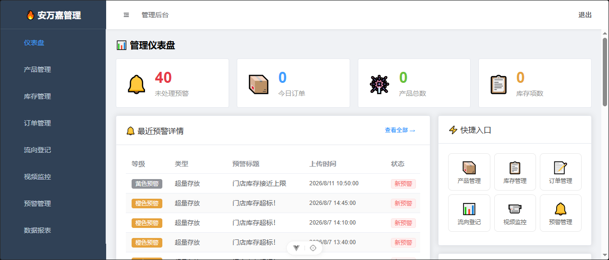
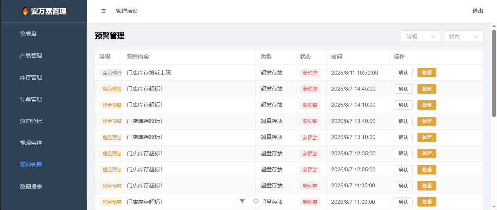
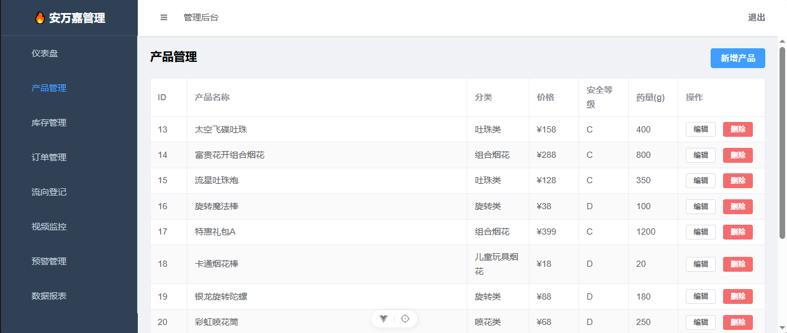
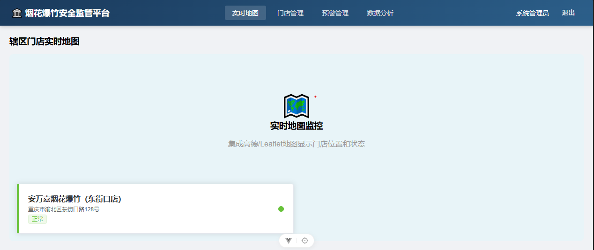
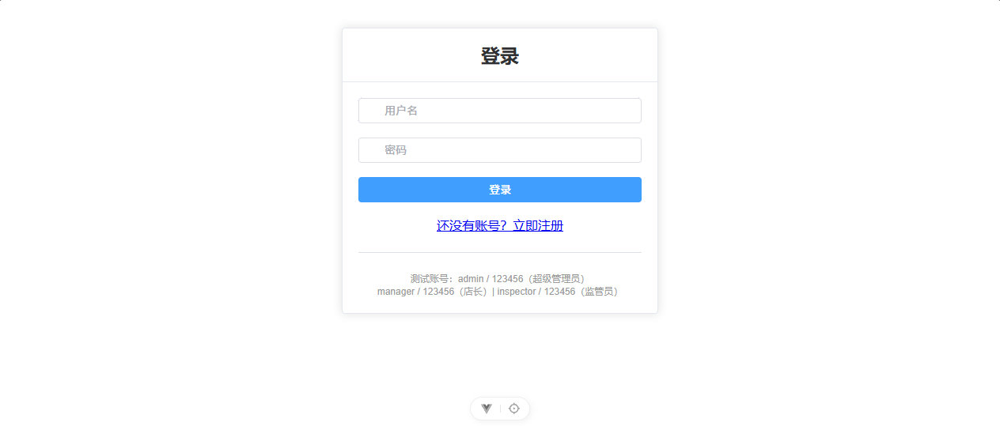

# 🎆 安万嘉烟花智慧零售与风险监测系统

烟花爆竹零售门店的智慧化管理平台——集商品展示、扫码下单、进销存、流向登记、IoT 实时监控、风险预警于一体的全栈解决方案。

**技术栈**：Vue 3 + TypeScript + Element Plus + Express + Prisma + Socket.IO + MQTT + Docker  
**合规标准**：GB 10631—2025 / AQ 4101—2026 / AQ 4102—2026

---

## 📋 系统概览

系统面向三条产品线，覆盖烟花爆竹零售全链路：

| 产品线 | 用户 | 核心功能 |
|---|---|---|
| **顾客端 H5** | 到店顾客 | 扫码浏览、下单、购物车、到店自提、安全告知电子签名 |
| **企业管理后台** | 门店/企业 | 商品管理、进销存、流向登记、视频监控、预警处理、数据报表 |
| **政府监管端** | 应急管理局 | 实时地图、一企一档、预警督查、移动执法巡查 |

## 📸 系统截图

| 管理后台仪表盘 | 预警管理 |
|---|---|
|  |  |

| 产品管理 | 政府监管地图 |
|---|---|
|  |  |

| 登录页 |
|---|
|  |

## 🏗️ 技术架构

```
┌─────────────────────────────────────────────────────────┐
│                    前端 (Vue 3 SPA)                       │
│  Vue 3 + TypeScript + Element Plus + Pinia + Vue Router   │
│      顾客端 H5  │  企业管理后台  │  政府监管端              │
└─────────────────────┬───────────────────────────────────┘
                      │ HTTP (REST) / WebSocket
┌─────────────────────▼───────────────────────────────────┐
│                  Nginx (反向代理 + 静态资源)               │
└─────────────────────┬───────────────────────────────────┘
                      │
┌─────────────────────▼───────────────────────────────────┐
│                Express 4 后端服务                         │
│  ┌──────────┬──────────┬──────────┬──────────────────┐  │
│  │ JWT 认证  │ RBAC 权限 │ Zod 校验  │ Winston 日志    │  │
│  │ (双Token) │ (6角色)   │          │                  │  │
│  └──────────┴──────────┴──────────┴──────────────────┘  │
│  ┌──────────────────────────────────────────────────┐   │
│  │ 规则引擎 ─ 8大风险场景 ─ 分级预警(黄/橙/红) ─ 冷却/升级 │   │
│  └──────────────────────────────────────────────────┘   │
│  ┌──────────────────────────────────────────────────┐   │
│  │     Socket.IO 实时推送   │   定时任务 (node-cron)  │   │
│  └──────────────────────────────────────────────────┘   │
└─────────────────────┬───────────────────────────────────┘
                      │
┌─────────────────────▼───────────────────────────────────┐
│                   数据层                                  │
│  ┌──────────┬──────────┬──────────┬──────────────────┐  │
│  │ Prisma   │PostgreSQL│  EMQX    │  文件存储 (本地/OSS)│  │
│  │ ORM      │ / SQLite │ MQTT Broker│                 │  │
│  └──────────┴──────────┴──────────┴──────────────────┘  │
└─────────────────────────────────────────────────────────┘
                      │
┌─────────────────────▼───────────────────────────────────┐
│              IoT 设备接入层 (MQTT + Modbus)               │
│  ┌─────────────────────┐  ┌────────────────────────────┐ │
│  │  Modbus TCP 模拟器    │  │  MQTT 设备 (EMQX Cloud)    │ │
│  │  (温湿度/烟雾传感器)   │  │  温湿度 │ 烟雾 │ 红外 │ 继电器│ │
│  │  寄存器地址 0-3       │  │  QoS 1 + Will Message     │ │
│  └─────────┬───────────┘  └────────────┬───────────────┘ │
│            │ 功能码03轮询(5s)           │ wss://8084       │
│  ┌─────────▼───────────────────────────▼───────────────┐  │
│  │        Modbus→MQTT 协议桥接器 (边缘网关)              │  │
│  │        寄存器 ÷10 → JSON → MQTT Topic                │  │
│  └─────────────────────────────────────────────────────┘  │
└─────────────────────────────────────────────────────────┘
```

## 🔥 核心功能亮点

### 1. IoT 设备接入与实时监控
- 基于 **EMQX Cloud MQTT Broker**（wss:// 云端接入）管理温湿度、烟雾、红外计数、继电器控制等设备
- **MQTT Topic 五级分层设计**：`项目/门店/设备类型/设备号/动作`，支持 `+` `#` 通配符灵活订阅
- **QoS 1** 选型保障安全数据不丢包，遗嘱消息(Will Message) + Retain 机制保证设备离线可感知
- **设备影子(Device Shadow)**：reported（实际上报）+ desired（期望配置），设备离线配置不丢，上线自动同步

### 2. Modbus 工业协议集成
- **Modbus TCP 设备模拟器**：在 5020 端口模拟工业温湿度+烟雾传感器，含 4 个 Holding Register + 数据漂移仿真
- **Modbus→MQTT 协议桥接器**：功能码 03 周期轮询(5s) → 读取寄存器原始值 → 换算(÷10)→ 包装为 JSON → MQTT 上报云端
- 实现边缘网关模式：Modbus RTU/TCP 设备 → Bridge 翻译 → MQTT → 云端平台

### 3. 智能风险预警引擎
- **8 大风险场景**：超量存放 / 人员聚集 / 吸烟检测 / 超范围经营 / 店外违规 / 店外试放 / 温湿度异常 / 烟雾火情
- **可配置规则**：指标 + 运算符 + 阈值 + 冷却窗口 + 升级机制
- **三级预警**：黄色（注意）→ 橙色（严重）→ 红色（紧急）
- **实时推送**：Socket.IO 按门店房间推送，支持企业端和监管端同时接收

### 4. 全链路流向登记 (AQ 4102)
- 商品采购 → 入库 → 销售 → 出库全链路追踪
- 电子签名确认，符合 AQ 4102—2026 合规要求

### 5. RBAC 权限体系
- **6 种角色**：超级管理员 / 政府检查员 / 企业管理员 / 门店经理 / 店员 / 顾客
- 双 Token 机制（access + refresh），自动续期，企业级安全标准

### 6. 政府监管一张图
- 基于地图的辖区门店总览
- 一企一档台账，支持移动执法巡查
- 预警数据实时上屏，督查反馈闭环

## 🛠️ 技术栈详情

### 前端
| 技术 | 用途 |
|---|---|
| Vue 3 (Composition API) | UI 框架，`<script setup lang="ts">` |
| TypeScript (strict) | 类型安全 |
| Element Plus | 企业级 UI 组件库（管理后台/政府端） |
| Pinia | 状态管理（auth / cart / alert / app） |
| Vue Router 5 | 路由 + 导航守卫（JWT 解析 + 角色匹配） |
| Axios | HTTP 请求封装 + 拦截器（自动 refresh token） |
| Vite 5 | 构建工具，@ 路径别名，API 代理 |

### 后端
| 技术 | 用途 |
|---|---|
| Express 4 | Web 框架 |
| Prisma ORM | 数据库操作，18 张数据表 |
| PostgreSQL / SQLite | 数据库（生产/开发） |
| JWT (jsonwebtoken) | 双 Token 认证，access 15min + refresh 7d |
| bcryptjs | 密码加密 |
| Zod | 请求参数校验 |
| Socket.IO | 实时预警推送 |
| MQTT (mqtt.js) | IoT 设备通信 |
| Winston + Morgan | 日志系统 |
| node-cron | 定时任务（定期检查 + 告警升级） |
| Multer | 文件上传 |

### 部署运维
| 技术 | 用途 |
|---|---|
| Docker Compose | 一键部署（Nginx + Node + PostgreSQL + EMQX + 备份） |
| Nginx | 反向代理 + 静态资源服务 |
| GitHub Actions | CI/CD（TODO） |

## 📦 快速开始

### 环境要求
- Node.js >= 18
- npm >= 9

### 本地开发

```bash
# 1. 克隆项目
git clone git@github.com:HeQingyan-engi/fireworks-safety-platform.git
cd fireworks-safety-platform

# 2. 安装前端依赖
npm install

# 3. 安装后端依赖
cd server
npm install

# 4. 配置环境变量
cp .env.example .env
# 编辑 .env 填入数据库连接等配置

# 5. 初始化数据库
npm run db:generate
npm run db:migrate
npm run db:seed

# 6. 启动后端 (终端1，端口 3000)
npm run dev

# 7. 启动前端 (终端2，端口 5173)
cd ..
npm run dev

# 访问 http://localhost:5173
# 测试账号: admin / 123456
```

### Docker 部署

```bash
cd server
cp .env.example .env         # 编辑 .env 配置
docker compose up -d         # 启动全部服务
```

## 📁 项目结构

```
fireworks-safety-platform/
├── src/                         # 前端源码
│   ├── api/                     # Axios 封装 + 接口模块
│   ├── components/              # 共享组件 (ProductCard, SignaturePad, 监控组件)
│   ├── layouts/                 # 布局: 顾客端 / 管理后台 / 政府端
│   ├── router/                  # 路由 + 导航守卫
│   ├── stores/                  # Pinia 状态管理
│   ├── types/                   # TypeScript 类型定义
│   └── views/                   # 页面组件 (admin/  gov/)
├── server/                      # 后端源码
│   ├── prisma/
│   │   ├── schema.prisma        # 数据模型 (18 张表, 6 大枚举)
│   │   └── seed.ts              # 种子数据
│   ├── src/
│   │   ├── config/              # 环境变量 + 上传配置
│   │   ├── controllers/         # 路由处理器 (10 个模块)
│   │   ├── middleware/          # auth (JWT+RBAC), errorHandler, validate
│   │   ├── routes/              # 15 个路由模块
│   │   ├── services/            # 风险检测, 规则引擎, MQTT, Socket, 定时任务
│   │   └── utils/               # jwt, password, logger, audit
│   ├── docker-compose.yml       # Docker 编排
│   └── nginx.conf               # Nginx 配置
└── docs/
    └── PROPOSAL.md              # 完整技术方案
```

## 📊 数据库模型

核心实体关系：

```
User (6角色) ──→ Store ──→ Inventory ←── Product
                              │                │
                              ↓                ↓
                          Device           Category
                              │
                              ↓
              Alert ←── DeviceReading
                │
                ↓
              Order ←── OrderItem ←── Product
                │
                ↓
           FlowRecord (流向登记, AQ 4102)
```

共 18 张数据表，完整覆盖零售门店的进销存、IoT 监控、预警处置、流向追溯四大业务域。

## 🎯 适用场景

- 烟花爆竹零售门店数字化管理
- 危化品/特种行业 IoT 监控与风险预警
- 政企联动监管平台（企业自管 + 政府监管）
- 智慧消防 / 智慧安防 / 智慧园区 IoT 平台参考实现

## 📄 License

MIT

---

**作者**：何清彦  
**技术栈关键词**：Vue3 · TypeScript · Express · Prisma · MQTT(EMQX Cloud) · Modbus TCP · Socket.IO · Docker · 物联网 · 风险预警 · RBAC · 边缘计算
